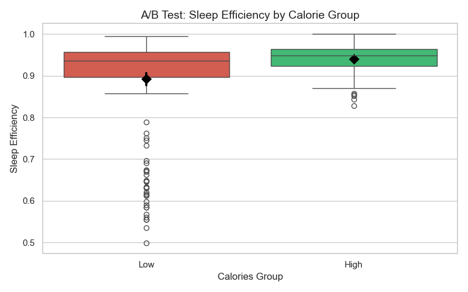
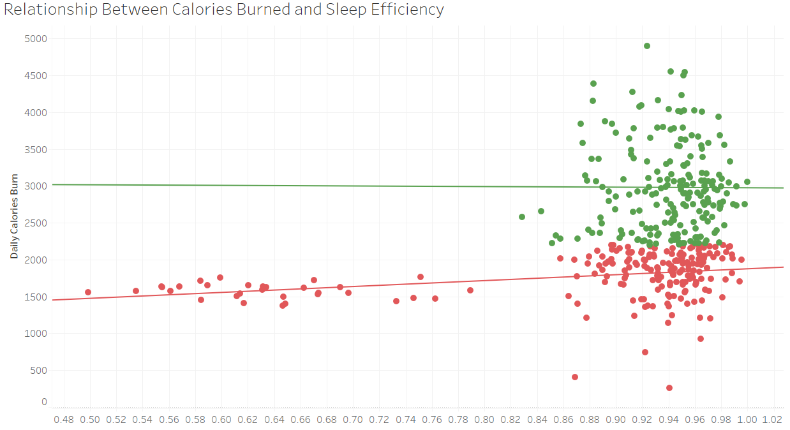
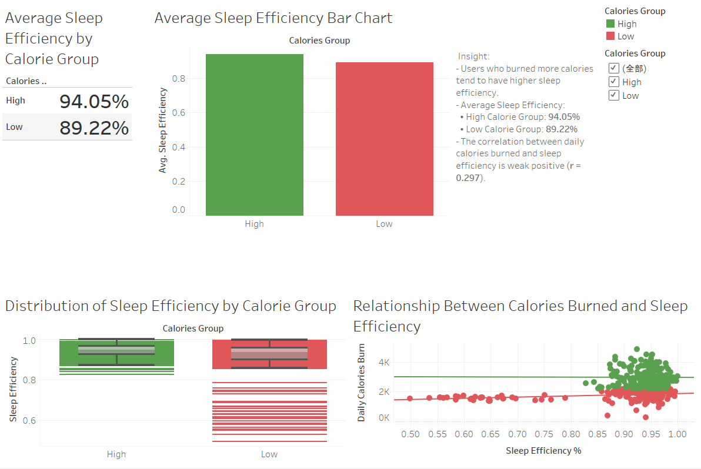

# 💤 Does Higher Calorie Burn Lead to Better Sleep?

**A/B Testing & Data Analysis Project using Python, SQL & Tableau**

## 🔍 Project Overview

This project explores whether individuals who burn more calories per day tend to achieve better sleep efficiency. Using real-world Fitbit data, we aim to evaluate the impact of daily physical activity on sleep quality through a combination of statistical testing and data visualization.

The project workflow includes:
- Cleaning and merging daily activity and sleep datasets
- Categorizing users into High and Low Calorie Burn groups
- Performing A/B Testing using Welch’s t-test to compare sleep efficiency
- Measuring correlation using Pearson’s r
- Creating a Tableau dashboard to present the findings visually

The goal is to draw meaningful insights that can inform user health behaviors and product recommendations in wellness-related platforms.

---

## 📁 Dataset

- **Source**: Merged from `sleepDay.csv` and `dailyCalories.csv` (Fitbit data)
- **Size**: 413 records across multiple users
- **Key Fields**:
  - `Calories`
  - `SleepEfficiency`
  - `CaloriesGroup` (High / Low, based on threshold)

---

## 🛠 Tools Used

| Tool     | Purpose                                 |
|----------|-----------------------------------------|
| **Python (Pandas, SciPy, Seaborn)** | Data cleaning, A/B testing, visualization |
| **SQL (BigQuery)**                | Group creation, aggregation, correlation   |
| **Tableau**                      | Dashboard for stakeholder presentation     |

---

## 📊 Key Insights

| Group   | Sleep Efficiency (avg) | Std Dev |
|---------|------------------------|---------|
| High    | 94.05%                 | 0.0319  |
| Low     | 89.22%                 | 0.1149  |

- A **Welch's t-test** showed a significant difference between groups (t = 5.77, p < 0.001)
- Pearson correlation coefficient: **r = 0.297**
- Sleep efficiency tends to increase with higher calorie burn

---

## 📂 Project Structure
```plaintext
Sleep_Calories/
├── dataset/                        # Raw and cleaned datasets
│   ├── calories_sleep_merged.csv  # Final merged and cleaned dataset
│   └── mturkfitbit_export_*.csv   # Original raw Fitbit export files
├── img/                           # Image folder for README and visuals
├── AB_Testing.py                  # Python script for A/B testing and visualization
├── data_cleanning.py              # Python script for data cleaning
├── calories_sleep_analysis.sql    # BigQuery SQL script for correlation analysis
├── Sleep_Calories.twbx            # Tableau dashboard packaged file (for Public)
├── Does Higher Calorie Burn Lead to Better Sleep.twb  # Tableau working file
├── Insight Summary                # Summary of key findings and insights
├── README.md                      # Project documentation (this file)
└── archive.zip                    # Archived original dataset
```
---

## 🧪 A/B Testing Summary

To determine whether individuals who burn more calories tend to sleep better, we conducted an A/B test using **Welch’s t-test**, which is appropriate when two groups have unequal variances and sample sizes.

We compared **Sleep Efficiency** between the following groups:

- **High Calorie Burn Group** (n = 210)  
- **Low Calorie Burn Group** (n = 203)

### 🧾 Results:

- **t-statistic** = `5.77`  
- **p-value** = `2.48e-08`  
- **Conclusion**: The difference in sleep efficiency between the two groups is **statistically significant** at the 0.01 level.

### 📦 Interpretation:

- Participants who burned more daily calories slept more efficiently.
- This supports the hypothesis that higher energy expenditure is associated with better sleep quality.

### 📉 Visualization:



---

## 📈 Correlation Analysis

To quantify the relationship between calories burned and sleep efficiency, we calculated the **Pearson correlation coefficient**.

### 🔍 Result:
- **Pearson’s r** = `0.297`  
- **p-value** < `0.001`

### 📦 Interpretation:
- The correlation is **positive and statistically significant**, though relatively weak.
- This indicates that people who burn more calories each day tend to sleep more efficiently.

### 📉 Visualization:



---

## 📊 Tableau Dashboard

All key insights were compiled into an interactive Tableau Dashboard to support business storytelling and visual exploration.

### 🔗 [View the Dashboard on Tableau Public](https://public.tableau.com/app/profile/yunuo.zhang/viz/DoesHigherCalorieBurnLeadtoBetterSleep/DoesBurningMoreCaloriesImproveSleepEfficiency)

### 🖼️ Dashboard Preview:



### 📌 Highlights:
- Visual comparison of **average sleep efficiency** between High and Low Calorie groups  
- Boxplot to display **distribution and variance** of sleep efficiency  
- Scatterplot with trend lines to show **correlation** between calories burned and sleep efficiency  
- Embedded business insights panel for easy interpretation

---

## 💡 Business Recommendations

Based on the findings from the A/B testing and correlation analysis, we can offer the following actionable insights:

- **Promote physical activity** as a way to improve sleep quality:  
  Users who burn more calories tend to have higher sleep efficiency.
  
- **Integrate activity-sleep feedback loops** into health platforms:  
  Encouraging users to track both exercise and sleep may lead to improved overall wellness.

- **Personalized goal setting**:  
  Fitness or health apps can recommend daily calorie burn targets based on individual sleep quality trends.

---

These findings support the idea that increasing physical activity could play a role in enhancing recovery, energy, and productivity through better sleep.

---

## 🙋 About Me

**Yunuo Zhang**  
Data Analyst with experience in SQL, Python, Tableau, and A/B Testing.  
📫 [LinkedIn](https://www.linkedin.com/in/yunuo-zhang-955119185/) | [GitHub](https://github.com/lychee749)